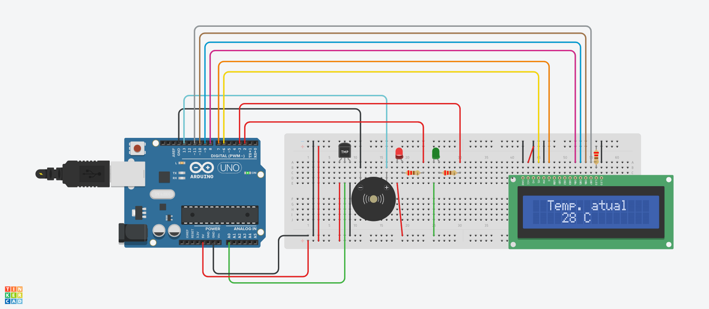

# Global Solution - Blue Future 🌊

## Nomes & RM's

<h2>

<li>RM 555499 - Matheus Montovaneli</li>
<li>RM 557789 - Thomaz Morais Neves </li>
<li>RM 555768 - Guilherme Linard </li>

# Monitoramento de Temperatura com Arduino!



<h2>Link da simulação no <strong><a href="https://www.tinkercad.com/things/3geKbB7ydkX-gs-blue-future-monitoramento-de-temp?sharecode=3_KM0jg6uO8vS7xDiWb8SzA6_7vfyC71Rq7_B752mqs">Tinkercad</a></strong></h2>


<li> 🟢 Verde: Temperatura adequada. </li>
<li> 🔴 Vermelho: Temperatura alta. </li>

## Componentes

<li>1x Arduino Uno R3</li>
<li>1x Sensor de temperatura [TMP36]</li> 
<li>1x Piezo</li>
<li>1x Led Vermelho</li>
<li>1x Led Verde</li>
<li>3x Resistores 220</li>
<li>1x LCD 16x2</li>


## Explicando o <a href="">Código</a>

```C
#include <LiquidCrystal.h>

#define RED_LED 2
#define GREEN_LED 3

LiquidCrystal lcd(6, 7, 8, 9, 10, 11);
int sensor = 0;
float sensorValue;
float outputVoltage;
float temperature;
bool alertaEnviado = false;
int buzzPin = 13; 
```

Começamos inicializando o programa, incluindo a biblioteca `LiquidCrystal.h` e definindo algumas constantes e variáveis globais. As constantes `RED_LED` e `GREEN_LED` representam os pinos conectados aos LEDs vermelho e verde, respectivamente. Um objeto lcd é criado para controlar o display LCD. O pino sensor é definido como o pino analógico conectado ao sensor de temperatura. As variáveis `sensorValue`, `outputVoltage` e `temperature` são utilizadas para ler e armazenar os valores do sensor. A variável `alertaEnviado` controla se o alerta de temperatura elevada já foi enviado. Por fim, `buzzPin` é o pino conectado ao buzzer para emitir um som de alerta.

```c
void setup() {
  Serial.begin(9600);
  Serial.println("O Arduino foi iniciado!");

  pinMode(RED_LED, OUTPUT);
  pinMode(GREEN_LED, OUTPUT);

  lcd.begin(16, 2);
}
```

Neste bloco, dentro da função `setup()`, a comunicação serial é inicializada para debug. Os pinos `RED_LED` e `GREEN_LED` são definidos como saídas. O display LCD é inicializado com 16 colunas e 2 linhas.

```c
void loop() {
  lcd.clear();

  sensorValue = analogRead(sensor);

  temperature = sensorValue / 1024;    
  temperature *= 5;                    
  temperature -= 0.5;                  
  temperature *= 100;                  
  
  int tempCerta = map(temperature, -40, 124,-10, 40);

  lcd.setCursor(2, 0);
  lcd.print("Temp. atual");
  lcd.setCursor(4, 2);
  lcd.print(tempCerta);
  lcd.print(" C");

  if (tempCerta >= 25 && !alertaEnviado) {
    Serial.println("Temperatura elevada, mandando alerta às Organizacoes!");
    lcd.setCursor(2, 0);
    lcd.print("Temp Elevada!");
    tone(buzzPin, 1000); 

    digitalWrite(RED_LED, HIGH);
    digitalWrite(GREEN_LED, LOW);

    alertaEnviado = true; 
  } else if (tempCerta < 25 && alertaEnviado) {
    
    noTone(buzzPin); 
 
    lcd.setCursor(2, 0);
    lcd.print("Temp Normal!");
   

    digitalWrite(GREEN_LED, HIGH);
    digitalWrite(RED_LED, LOW); 
    
    alertaEnviado = false; 
  }

  delay(1000);
}
```

Neste bloco, dentro da função `loop()`, o display LCD é limpo e a leitura do sensor de temperatura é realizada. A temperatura é convertida para graus Celsius e mapeada para um intervalo mais legível. A temperatura é exibida no LCD. Em seguida, verifica-se se a temperatura está acima de 25 graus Celsius e se o alerta ainda não foi enviado. Se verdadeiro, um alerta sonoro é emitido, o LED vermelho é aceso e a mensagem "Temp Elevada!" é exibida no LCD. Se a temperatura estiver abaixo de 25 graus Celsius e o alerta tiver sido enviado, o alerta sonoro é interrompido, o LED verde é aceso e a mensagem "Temp Normal!" é exibida no LCD. A variável `alertaEnviado` é ajustada de acordo para indicar se o alerta foi ou não enviado. Finalmente, um atraso de 1 segundo é inserido antes da próxima iteração do loop principal.

## Objetivo

Este código monitora continuamente a temperatura do oceano, emitindo alertas `visuais e sonoros` quando a temperatura ultrapassa ou volta ao normal. Ele fornece `feedback visual e audível` para ajudar a monitorar a temperatura dentro de limites desejados.
